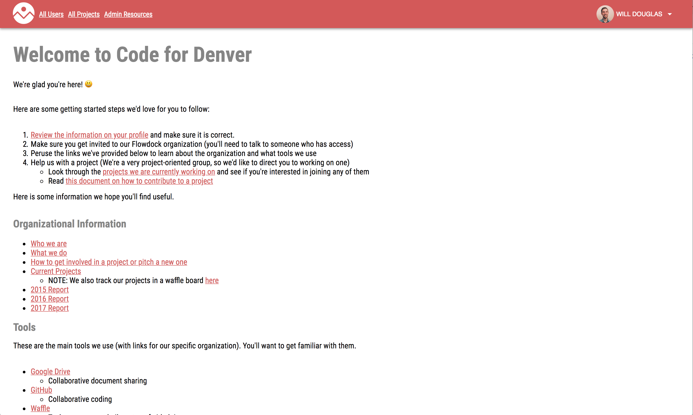
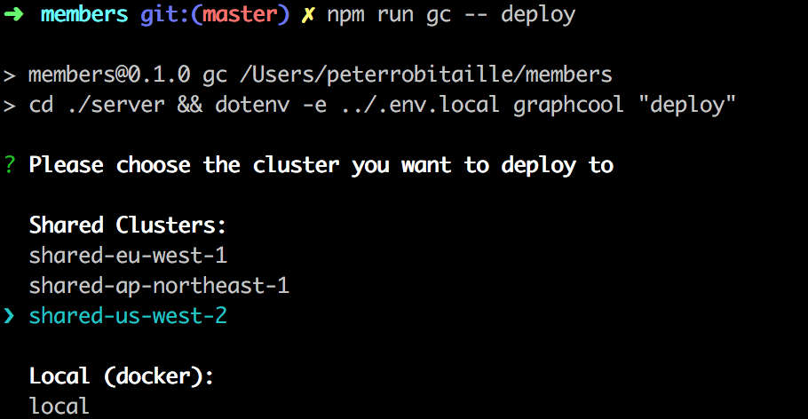
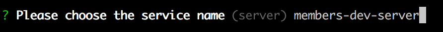

[](https://travis-ci.org/codefordenver/members)

# members.codefordenver.com

Online portal for Code for Denver member resources



---

## Requirements

- [Node.js](https://nodejs.org) - version 10.8.0 (if you have [nvm](https://github.com/creationix/nvm) type `nvm use` in the repo to use the correct version)

Setup:

1. clone repo
2. cd into repo directory
3. Run `npm install`
   > You may also want to install a [prettier](https://prettier.io/docs/en/index.html) plugin for your editor. [Check here for setup instructions](https://prettier.io/docs/en/editors.html)
4. Follow the following instructions to set up Auth0 and the API Explorer:

   1. Visit https://auth0.com/ and create a new Auth0 account or log-in to your existing one
      > it will ask you for a tenant domain. Here you can just enter in your username as this will be used for the API endpoints of your clients.
      2. Select `API` from the side menu
      3. Select `Auth0 Management API`
      4. Select the `API Explorer` tab
      5. Select `CREATE & AUTHORIZE A TEST CLIENT`. This creates a client that can use the Management API.
      6. Select `Applications` from the side menu
      7. Select `API Explorer Application`

   (To enable Log In/ Sign Up functionality, please go to your Auth0 dashboard, navigate to "Hosted Pages", and enter the following: `initialScreen: config.extraParams.initial_screen,` on line 46 (within the `Auth0Lock` third argument object))

5. Go the the command line and run `npm run setup` (You will be asked for the `Domain`, `Client ID`, and `Client Secret` from the
   `API Explorer Client`. Paste them into the command line). This will create the `.env.local` file in the root of the project.

6. run `npm run gc -- deploy`
7. Enter in the following information in your terminal:
   
   
   
8. If prompted to authenticate, enter in the `Auth URL` into your browser
9. Sign up for Graphcool
10. from the output from the previous command copy the `Simple API` url and add it to the `.env.local` file for variable `REACT_APP_GRAPHCOOL_API`
11. run `npm start`

## Quick Start

After you've followed the set up steps listed above, you can subsequently start the app with:

```
npm start
```

## Developing

### Create React App

The front end for this project was bootstrapped with [Create React App](https://github.com/facebookincubator/create-react-app). Make sure to check out the excellent docs for the project [here](https://facebook.github.io/create-react-app/). They outline info about the project as well as how a bunch of ways to configure it and add different tools and libraries.

### Interacting with the Backend

This project uses [graphql](https://graphql.org/) for the API layer (see [the section on the server for more info](#server:-graphcool)). Queries and mutations should be written in `.graphql` files in the [src/graphql](./src/graphql) directory. Read the following section for information on how to use these in the React code.

### Code Generation

This project uses [graphql-code-generator](https://graphql-code-generator.com/) to generate code based on graphql files. When you start the app with `npm start` it will also start `graphql-code-generator` in watch mode so the generated files will automatically get updated. These generated files are based on a local json version of the schema (updated with `npm run download-schema`).

With this tool, the names of graphql queries and mutations will have associated TypeScript types defined in [./src/generated-models.tsx](./src/generated-models.tsx). Do not update this file manually. Instead, either run `npm start` or `npm run gql-gen` and the types will be updated.

### Apollo

The generated code mentioned in the above section uses the library [react-apollo](https://www.apollographql.com/docs/react/). Check out their docs [here](https://www.apollographql.com/docs/react/api/react-apollo.html).

### Material-UI

This project uses [Material-UI](https://material-ui.com/) for theming. Be sure to check out their component demos, like [this one for avatars](https://material-ui.com/demos/avatars/).

### Server: Graphcool

The [Graphcool framework](https://github.com/graphcool/framework) is used to spin up and manage the backend for this project.

1. Use locally installed version of framework with environment variable from `.env.local`

- `npm run gc -- <command>`

2. View list of available commands

- `npm run gc -- help`

3. Deploying the backend changes

- `npm run gc -- deploy`
  > NOTE: After deploying changes to the backend make sure to run `npm run download-schema` to update the local schema for proper code generation and eslint configuration

4. Interactive console to test out GraphQL

- `npm run gc -- playground`

## Debugging

### General

Start your app by running `npm start`, and start debugging in VS Code by pressing `F5` or by clicking the green debug icon with `Chrome` as the selected configuration. You can now write code, set breakpoints, make changes to the code, and debug your newly modified code—all from your editor.

### Tests

Start debugging in VS Code by pressing `F5` or by clicking the green debug icon with `Debug CRA Tests` as the selected configuration. You can now write tests, set breakpoints, make changes to the tests, and debug your newly modified tests—all from your editor. You can also debug tests using the VSCode Jest plugin (see the next section).

## Additional Tooling

### Browser Extensions

There are a few highly recommended browser extensions that will help you debug and test code:

- [React Dev Tools](https://chrome.google.com/webstore/detail/react-developer-tools/fmkadmapgofadopljbjfkapdkoienihi?hl=en)
- [Apollo Dev Tools](https://www.apollographql.com/docs/react/features/developer-tooling.html)

### Editor Plugins

It is recommended to install some editor plugins to help with development. Here are some great VSCode plugins:

- [Eslint](https://marketplace.visualstudio.com/items?itemName=dbaeumer.vscode-eslint)
- [Jest](https://marketplace.visualstudio.com/items?itemName=Orta.vscode-jest)
- [Prettier - Code formatter](https://marketplace.visualstudio.com/items?itemName=esbenp.prettier-vscode)
- [GraphQL for VSCode](https://marketplace.visualstudio.com/items?itemName=kumar-harsh.graphql-for-vscode)

## Additional Information

### Linting

This project employs the ESLint plugin [eslint-plugin-graphql](https://github.com/apollographql/eslint-plugin-graphql) to help developers write schema-compliant GraphQL queries. This plugin will red-line invalid queries that are not schema compliant if you are using an editor with an installed ESLint plugin. If a query fails validation and hence the lint, the travis build will fail as well.

The schema file is checked in to the root directory of the repository as `full-schema.json`. If the schema on Graphcool is updated and `full-schema.json` is out of date. It is necessary to run the `download-schema` NPM script in order to update linting information.

### Typescript

This project uses [typescript](https://www.typescriptlang.org/) a superset of javascript with static typing. If this is your first exposure to Typescript, check out [this intro guide](https://www.typescriptlang.org/docs/handbook/typescript-in-5-minutes.html).

It is highly recommended that you use an editor that supports typescript type checking and additional features (like autocomplete). VS Code is a great option that supports Typescript out of the box.

Additionally, you have the option to run typechecking from the command line directly with `npm run typecheck`
