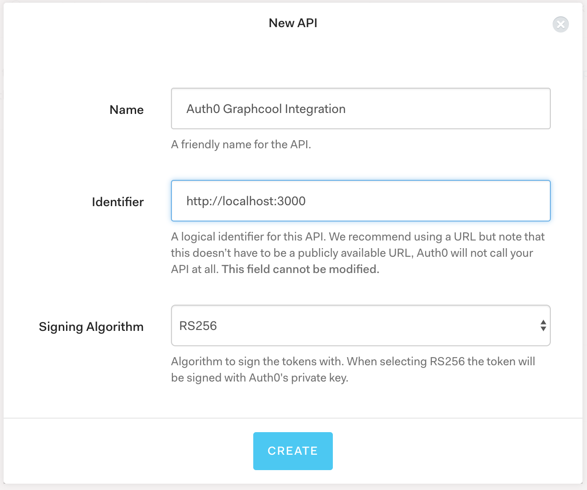
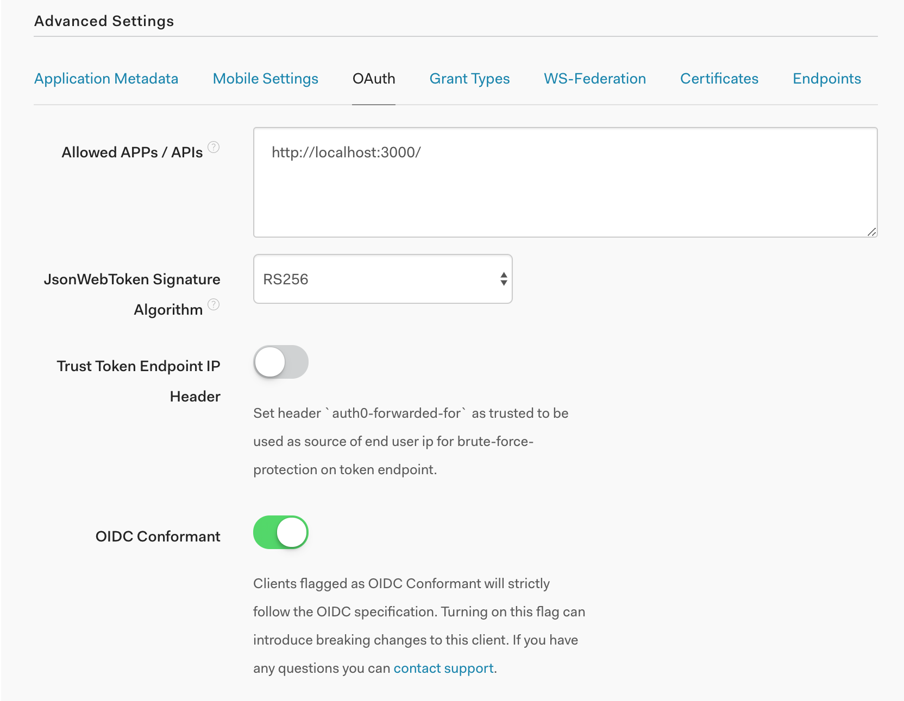
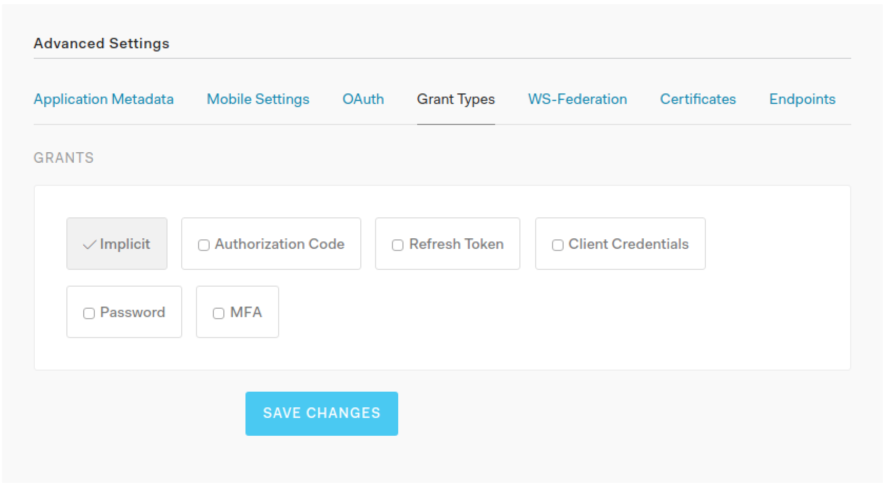
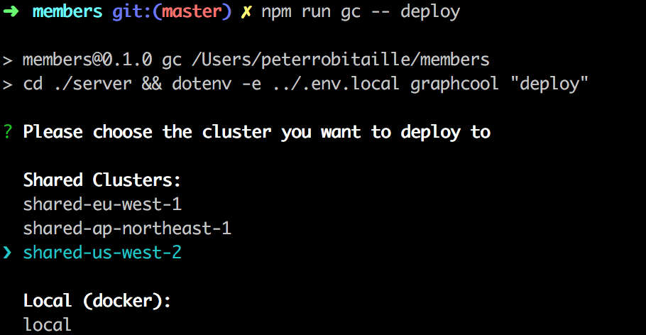
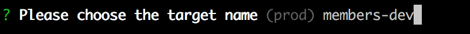
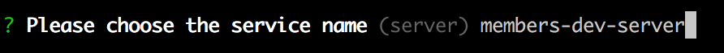

[](https://waffle.io/codefordenver/members?utm_source=badge)

# members.codefordenver.com

Node.js application that connects volunteers with volunteers/projects based on their skill sets.

---

## Requirements


- [Node.js](https://nodejs.org) - version 8.4 (if you have nvm type `nvm use` in the repo to use the correct version)

Setup:
1. clone repo
2. cd into repo directory
3. Run `npm install`
4. Run `npm run setup` (this should create a new `.env.local` file in the root of the project)
5. Follow the following instructions to set up Auth0:
  1. Visit https://auth0.com/ and create a new Auth0 account or log-in to your existing one
    - it will ask you for a tenant domain. Here you can just enter in your username as this will be used for the API endpoints of your clients.
  2. Select `API` from the side menu
  3. Select `Create API`
  4. Enter in the following information into the form:
  
  5. Select `Client` from the side menu
  6. Select the client that was just created
  7. Make sure to fill in the following fields:
    - Client Type - Regular Web Application
    - Token Endpoint Authentication Method - Post
    - Allowed Callback URLs - http://localhost:3000/
  8. In Advanced Settings Section - OAuth tab set JWT Signature Algorithm to value RS256 and turn on the OIDC Conformant swith.
  
  9. In Advanced Settings Section - Grant Types tab only leave the Implicit grant type enabled.
  

6. In the newly created `.env.local` file fill in what the following values from Auth0:
- You can find this information by selecting `Client` from the side menu then select the client that was just created.
- `REACT_APP_AUTH0_CLIENT_ID` as your Auth0 client id
- `REACT_APP_AUTH0_DOMAIN` and `AUTH0_DOMAIN` as your Auth0 domain
- `AUTH0_API_IDENTIFIER` as http://localhost:3000
7. run `npm run gc -- deploy`
8. Enter in the following information in your terminal:



9. Enter in the `Auth URL` into your browser
10. Sign up for Graphcool
11. from the output from the previous command copy the `Simple API` url and add it to the `.env.local` file for variable `REACT_APP_GRAPHCOOL_API`
12. cd back to the root of the repo and run `npm start`

## Quick Start
After you've followed the set up steps listed above, you can subsequently start the app with:

```
npm start
```

## Graphcool
The [Graphcool framework](https://github.com/graphcool/framework) is used to spin up and manage the backend for this project. To use the locally installed version of the framework with your environment variables from `.env.local`, use `npm run gc -- <command>`. Run `npm run gc -- --help` to view a list of available commands.

### Create React App
The front end for this project was bootstrapped with [Create React App](https://github.com/facebookincubator/create-react-app). Here are some [generated docs](./docs/CreateReactApp.md) from this project for helpful tips on how to do common things.
